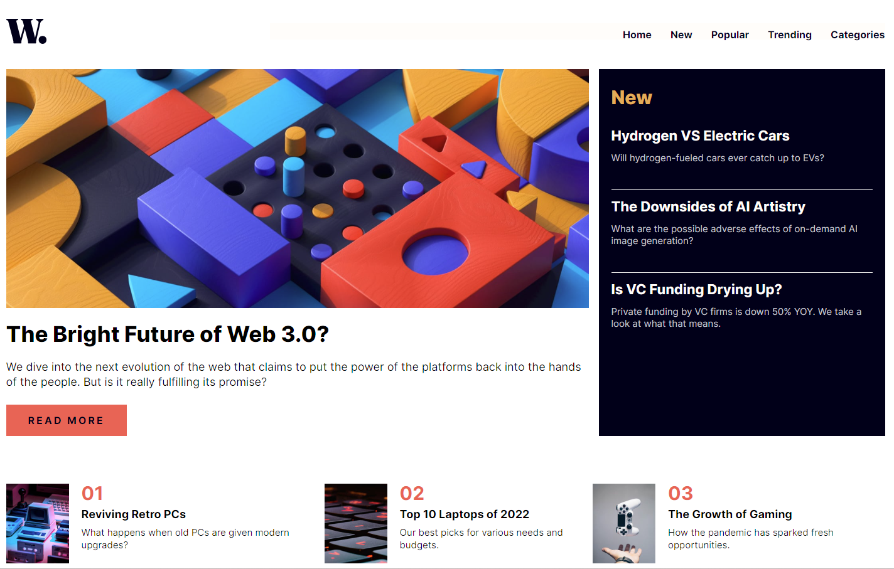

## Table of contents

- [Overview](#overview)
  - [The challenge](#the-challenge)
  - [Screenshot](#screenshot)
  - [Links](#links)
- [My process](#my-process)
  - [Built with](#built-with)
  - [Highlight](#highlight)
  - [Useful resources](#useful-resources)
- [Author](#author)

## Overview

### The challenge

Build out the news website homepage to look as close to the design documents as possible.

### Screenshot




### Links

- Solution URL: [Github](https://github.com/SteveNoyes/news-landing-page)
- Live Site URL: [Github live site](https://stevenoyes.github.io/news-landing-page/)

## My process

### Built with

- Mobile-first workflow
- Flexbox

### Highlight

```html
```
```css
```

### Useful resources

- [Transfonter](https://transfonter.org/) - This tool converts any TTF, OTF, WOFF, WOFF2 or SVG fonts to css @font-face formats with CSS and HTML sample files.
- [Reset CSS](https://meyerweb.com/eric/tools/css/reset/) - Reduce browser inconsistencies in things like default line heights, margins and font sizes of headings, and so on.
- [Image Reset CSS](https://gist.github.com/palashmon/35bda7887eb4bc45459d71eca3dda7a5) - This CSS block is a More Effective CSS Image Reset. It resets the default styles of an image element. 

## Author

- Website - [Steven Noyes](https://www.stevenmnoyes.com)